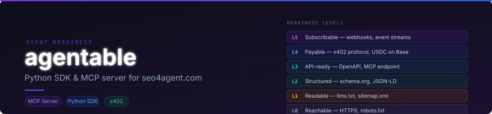
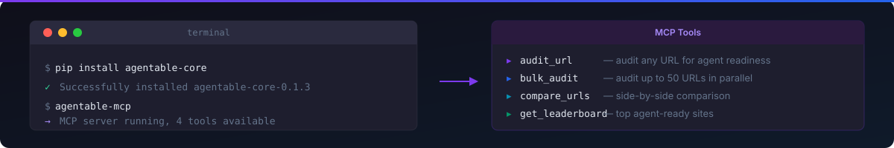

# agentable-core



Python SDK and MCP server for [seo4agent.com](https://seo4agent.com) — agent-readiness auditing.

## Install



```bash
pip install agentable-core
```

## MCP Server (Claude Desktop / Cursor / Windsurf)

Add to your `claude_desktop_config.json`:

```json
{
  "mcpServers": {
    "agentable": {
      "command": "agentable-mcp",
      "env": {
        "AGENTABLE_TOKEN": "your_jwt_token"
      }
    }
  }
}
```

Get your token at [seo4agent.com](https://seo4agent.com) → Settings.

### Available MCP tools

| Tool | Description | Plan |
|------|-------------|------|
| `audit_url` | Audit a single URL for agent readiness | Free (5/day) · Pro (unlimited) |
| `bulk_audit` | Audit up to 50 URLs in parallel | Pro only |
| `compare_urls` | Compare URLs side by side (2 Free / up to 8 Pro) | Free + Pro |
| `get_leaderboard` | Public leaderboard of top agent-ready sites | Free |

## Python SDK

```python
import asyncio
from agentable import AgentableClient

async def main():
    client = AgentableClient(token="your_token")
    
    # Single audit
    result = await client.audit("https://example.com")
    print(f"Level {result['level']} — {result['score_pct']}%")
    
    # Bulk audit
    results = await client.bulk_audit([
        "https://site1.com",
        "https://site2.com",
    ])
    
    # Compare
    comparison = await client.compare([
        "https://openai.com",
        "https://anthropic.com",
    ])

asyncio.run(main())
```

## x402 — Pay per audit (no account required)

The REST endpoint supports the [x402 payment protocol](https://x402.org) — pay **$0.10 USDC** per audit directly from any EVM wallet on Base, no account needed.

```js
import { wrapFetchWithPayment } from "@x402/fetch";
import { CdpX402Client } from "@coinbase/cdp-sdk/x402";

const client = new CdpX402Client();
const fetchWithPayment = wrapFetchWithPayment(fetch, client);

const res = await fetchWithPayment("https://seo4agent.com/audit/run", {
  method: "POST",
  headers: { "Content-Type": "application/json" },
  body: JSON.stringify({ url: "https://example.com" }),
});
```

See the [x402 buyer quickstart](https://docs.cdp.coinbase.com/x402/buyer/quickstart) for full setup.

## Environment variables

| Variable | Default | Description |
|----------|---------|-------------|
| `AGENTABLE_TOKEN` | — | JWT token from seo4agent.com |
| `AGENTABLE_BASE_URL` | `https://seo4agent.com` | API base URL |
